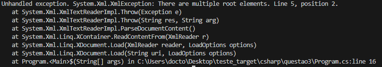
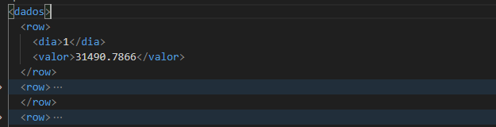

# Teste Target Sistemas - Estágio Desenvolvimento/ São Paulo

OBS: para rodar as questões do c#(https://learn.microsoft.com/pt-br/dotnet/core/install/windows) ou python(https://www.python.org/downloads/) tenha certeza de ter instalado as bibliotecas, lembrando que o .net core é multiplataforma então podera ser executado en diferentes sistemas operacionais.

1. No caso do c# entre dentro da pasta e rode a aplicação console referente o número da questão desejada e assim rode o comando "dotnet run" dentro da pasta, lá tera um arquivo Program.cs ele segue o padrão de pascal para nomear arquivos e classes e devido ao uso do mais novo framework do .Net não é preciso a declaração do namespace e nem da placasse program ou método estáctico Main().
2. No caso do python rode o comando "python nome_do_arquivo.py" perceba que o uso do snake case para nomeação do Arquivo

## Questão 1

Fiz o uso da função Enumerable.Range é perfeita para gerar sequências de números, e Sum oferece uma maneira limpa de somar os valores. Utilizar LINQ torna o código mais compacto e fácil de entender.

## Questão 2

Usei a desconstrução para atualizar os valores de Fibonacci de maneira mais legível. Em vez de armazenar toda a sequência, o algoritmo apenas itera até encontrar o número ou ultrapassá-lo, minimizando o uso de memória.

## Questão 3

A questão 3 é um pouco mais complexa fiz o uso dos arquivos com leitura do xml em c# e do json em python.

A primeira questão que me veio à mente foi: preciso realmente armazenar todos os valores? Na solução anterior, a criação de listas intermediárias para armazenar os valores de faturamento consumia memória desnecessariamente. Como o objetivo final é encontrar o menor, maior valor, calcular a média e contar os dias com faturamento acima da média, eu percebi que não havia necessidade de armazenar todos os valores na memória ao mesmo tempo.

Evitei o uso de listas ou estruturas desnecessárias e trabalhar diretamente com os dados conforme eles são lidos.

Separei o processamento em duas fases simples para evitar complicações.

Usei variáveis simples para garantir que o uso de memória não aumente conforme o tamanho dos dados.

## Questão 4

Fiz uso do LINQ que oferece uma forma natural de sumarizar os valores, enquanto a desconstrução em foreach ajuda a tornar o código mais legível e moderno, aproveitando as melhorias sintáticas do C#.

## Questão 5

Sabendo que strings são imutáveis, optei por criar um array de caracteres para realizar a inversão diretamente. Isso garante que o código seja eficiente tanto em termos de tempo quanto de memória.

OBS: Adotei duas linguagens para demonstrar as diferentes abordagens, tendo em vista que minha linguagem principal seria c# mas por conta da biblioteca .Net faria o uso de métodos prontos com melhor uso de memória e menor complexidade e não demonstrando as escolhas de código de uma maneira clara.

### Erros e solução

Erro referente a Questão 3 em c#

havia ocorrido este erro na fução que adicionei para a leitura por conta das multiplas rows no nível raiz, e isso era inválido.

para a solução eu escrevi um elemendo <dados> e emcapsulei todas rows

Comandos pra inicialização e push para a branch do git

```
git init
git add \*
git commit -m "first commit"
git branch -M main
git remote add origin https://github.com/fabianoGDB/teste_targetsistemas.git
git push -u origin main
```
